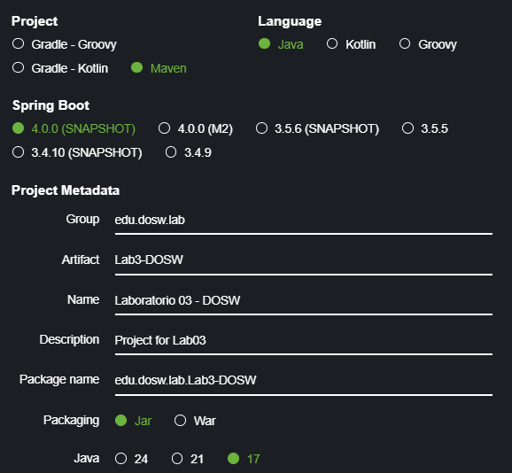
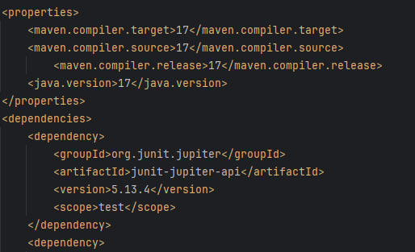
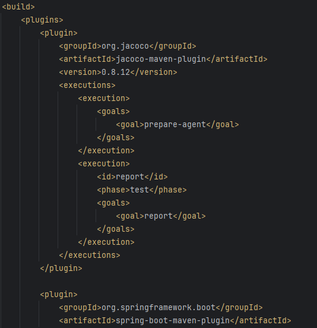

# Laboratorio 3 TDD

## Integrantes:
- Felipe Calvache
- Juan Sebastian Guayazán
- Kevin Cuitiva

**Nombre De la Rama**
'feature/lab3_Calvache_Guayazan_Cuitiva_2025-2'

---
## Parte 1 - Preparación del espacio de trabajo
Una vez ya hemos creado el repositorio, y que los 3 integrantes
ya hayamos clonado el repositorio localmente, creamos la rama de feature para 
empezar a crear el proyecto Maven con las siguientes configuraciones:

También entramos al archivo xml para editar el pom y colocar las dependencias que faltan:

También ponemos un nuevo build para jacoco

### Preguntas

1. ¿Cuál es la diferencia principal entre una prueba unitaria y una prueba de integración E2E? 
  * Las pruebas unitarias son el proceso en el que se prueba la unidad funcional de código más pequeña.
  * Las pruebas E2E garantizan que las aplicaciones se comporten como se espera y que el flujo de datos se mantenga para todo tipo de tareas y procesos del usuario
2. En Scrum ¿Cuál es el propósito de la Sprint Retrospective y porque es crucial para la mejora continua del equipo?

Es planificar formas de aumentar la calidad y la eficacia
Es un espacio para que el Equipo Scrum inspeccione y adapte sus prácticas de trabajo.
3. Explique la diferencia entre una Épica, una Feature y una historia de Usuario. Proporcione un ejemplo de cada una si tenemos un sistema de streaming de video como lo es Netflix. 
  * Las historias, también llamadas "historias de usuario", son breves requisitos o solicitudes escritas desde el punto de vista del usuario final.
  * Los epics son grandes cantidades de trabajo que se pueden desglosar en un número de tareas más pequeñas (llamadas "historias").
  * Las iniciativas son conjuntos de epics que conducen hacia un objetivo común.
4. ¿Qué es una cobertura de Código (code coverage) y porque una cobertura del 100% no garantiza necesariamente que el software esté libre de errores? 
La cobertura de código es una métrica que te ayuda a comprender qué parte de tu código fuente se prueba. Es una métrica muy útil que te permite evaluar la calidad de tu conjunto de pruebas. Aquí veremos cómo puedes empezar con tus proyectos.
No garantiza ya que solo asegura que cada línea de código se ejecutó, pero no valida si los resultados son correctos
5. Describa que es un Diagrama de Casos de Uso y que elementos lo componen. ¿Para qué sirve en la fase de análisis de requerimientos?
**Describa que es un Diagrama de Casos**
Un Diagrama de Casos de Uso es una herramienta de UML (Unified Modeling Language)
que permite representar de manera gráfica cómo interactúan los actores
(usuarios u otros sistemas) con un sistema, mostrando las funcionalidades que este debe ofrecer.
**Elementos que lo componen:**
- Actores: representan a los usuarios o sistemas externos que interactúan con el sistema.
- Casos de uso: son las funcionalidades o servicios que el sistema ofrece a los actores.
**¿Para qué sirve en la fase de análisis de requerimientos?**
- Ayuda a visualizar los requisitos funcionales de manera simple y entendible para usuarios y desarrolladores.
- Favorece la comunicación con los interesados (stakeholders), ya que no requiere conocimientos técnicos profundos.
- Permite identificar qué funciones son necesarias y cómo interactuarán los usuarios con ellas.
6. Diferencia entre JUnit, JaCoCo y SonarQube
JUnit: es un framework de pruebas unitarias en Java. Permite automatizar la verificación de que
cada componente del software funciona de manera aislada.
JaCoCo (Java Code Coverage): mide la cobertura de pruebas, es decir, qué porcentaje del
código fuente ha sido ejecutado por los tests (líneas, ramas, métodos, etc.).
SonarQube: es una herramienta de análisis estático de código que complementa lo anterior.
Permite revisar calidad del código en términos de:
- Duplicación.
- Complejidad ciclomática.
- Estándares de codificación.
- Vulnerabilidades de seguridad.
- Cobertura integrada con JaCoCo.
7. Ventajas de Planning Poker frente a métodos tradicionales
El Planning Poker es una técnica ágil de estimación basada en consenso. Cada miembro del equipo usa cartas con números (generalmente la serie Fibonacci) para estimar el esfuerzo de una tarea.
Ventajas frente a métodos tradicionales (ej. horas hombre, comparaciones históricas):
- Participación activa: todos los miembros del equipo estiman, no solo el líder o el más experto.
- Reducción de sesgos: evita que las opiniones dominantes influyan en los demás, porque todos muestran sus cartas al mismo tiempo.
- Mejora la discusión: cuando hay discrepancias, se abre diálogo sobre los distintos puntos de vista.
- Transparencia: las estimaciones son visibles y se entiende de dónde vienen.
- Compromiso: al ser una decisión en consenso, el equipo se siente más comprometido a cumplir con la estimación.
8. Valores de Scrum
Los 5 valores de Scrum son:
* Compromiso: el equipo se compromete con los objetivos y con entregar valor.
* Coraje: tener valentía para decir la verdad, afrontar problemas y proponer mejoras.
* Enfoque: concentrarse en el trabajo más importante y en el objetivo del sprint.
* Apertura: estar dispuesto a recibir y dar retroalimentación, aceptar nuevas ideas y cambios.
* Respeto: valorar a todos los miembros del equipo, sus capacidades y opiniones.
