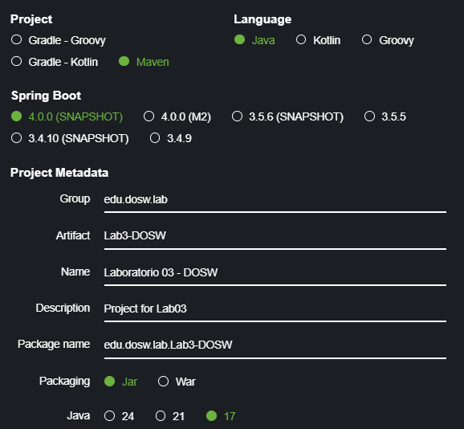

# Laboratorio 3 TDD

**Integrantes:**
- Felipe Calvache
- Juan Sebastian Guayazán
- Kevin Cuitiva

**Nombre De la Rama**
'feature/lab3_Calvache_Guayazan_Cuitiva_2025-2'

---

#### Preguntas 

#### E. Diagrama de Casos de Uso
Un Diagrama de Casos de Uso es una herramienta de UML (Unified Modeling Language)
que permite representar de manera gráfica cómo interactúan los actores
(usuarios u otros sistemas) con un sistema, mostrando las funcionalidades que este debe ofrecer.

## Elementos que lo componen:

- Actores: representan a los usuarios o sistemas externos que interactúan con el sistema.

- Casos de uso: son las funcionalidades o servicios que el sistema ofrece a los actores.

## ¿Para qué sirve en la fase de análisis de requerimientos?

- Ayuda a visualizar los requisitos funcionales de manera simple y entendible para usuarios y desarrolladores.

- Favorece la comunicación con los interesados (stakeholders), ya que no requiere conocimientos técnicos profundos.

- Permite identificar qué funciones son necesarias y cómo interactuarán los usuarios con ellas.

#### F. Diferencia entre JUnit, JaCoCo y SonarQube

JUnit: es un framework de pruebas unitarias en Java. Permite automatizar la verificación de que
cada componente del software funciona de manera aislada.

JaCoCo (Java Code Coverage): mide la cobertura de pruebas, es decir, qué porcentaje del
código fuente ha sido ejecutado por los tests (líneas, ramas, métodos, etc.).

SonarQube: es una herramienta de análisis estático de código que complementa lo anterior.
Permite revisar calidad del código en términos de:

- Duplicación.

- Complejidad ciclomática.

- Estándares de codificación.

- Vulnerabilidades de seguridad.

- Cobertura integrada con JaCoCo.

#### G. Ventajas de Planning Poker frente a métodos tradicionales
El Planning Poker es una técnica ágil de estimación basada en consenso. Cada miembro del equipo usa cartas con números (generalmente la serie Fibonacci) para estimar el esfuerzo de una tarea.

Ventajas frente a métodos tradicionales (ej. horas hombre, comparaciones históricas):

- Participación activa: todos los miembros del equipo estiman, no solo el líder o el más experto.

- Reducción de sesgos: evita que las opiniones dominantes influyan en los demás, porque todos muestran sus cartas al mismo tiempo.

- Mejora la discusión: cuando hay discrepancias, se abre diálogo sobre los distintos puntos de vista.

- Transparencia: las estimaciones son visibles y se entiende de dónde vienen.

- Compromiso: al ser una decisión en consenso, el equipo se siente más comprometido a cumplir con la estimación.

#### H. Valores de Scrum

Los 5 valores de Scrum son:

Compromiso: el equipo se compromete con los objetivos y con entregar valor.

Coraje: tener valentía para decir la verdad, afrontar problemas y proponer mejoras.

Enfoque: concentrarse en el trabajo más importante y en el objetivo del sprint.

Apertura: estar dispuesto a recibir y dar retroalimentación, aceptar nuevas ideas y cambios.

Respeto: valorar a todos los miembros del equipo, sus capacidades y opiniones.